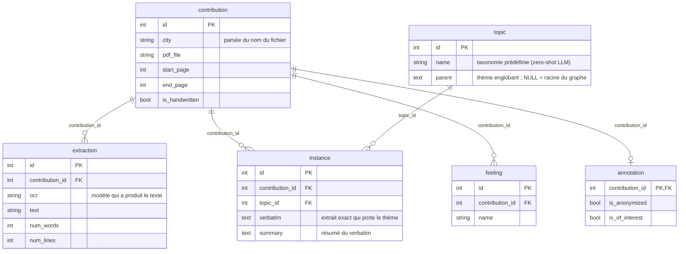

# Base de données : modèle et fonctionnement

## Le modèle



| Table | Contenu | Owner |
|---|---|---|
| `contribution` | métadonnées : commune, fichier, pages | équipe séparation |
| `extraction` | texte extrait une ligne par essai d'OCR | équipe extraction |
| `topic` | taxonomie des thèmes (graphe via `parent`), prédéfinie pour l'extraction zero-shot | équipe analyse |
| `instance` | détections de thèmes : verbatim + résumé, une ligne par détection | équipe analyse |
| `feeling` | sentiments détectés : une ligne par résultat | équipe analyse |
| `annotation` | variables activées dans l'app ("Anonymisé", "d'intérêt") | outil Gradio |

**La logique** : une tâche métier = une table, chaque équipe n'écrit que dans la sienne
(CR de réunion), et tout pointe vers `contribution.id`. **La pertinence** : aucune donnée
n'est écrite par deux équipes, et l'avancement se lit par l'existence des lignes (pas de
ligne `extraction` = pas encore extraite, pas de ligne `annotation` = pas encore annotée).

## Mettre à jour le modèle de données

La source de vérité est `database/models.py` ; Alembic versionne chaque évolution dans
`database/migrations/versions/` (committé, rejouable sur une base vierge).

Évolution **additive** (nouvelle colonne, nouvelle table) :

1. Modifier `database/models.py`
2. `uv run alembic revision --autogenerate -m "description"`
3. **Relire** le script généré dans `database/migrations/versions/`
4. `uv run alembic upgrade head`
5. Committer `models.py` + la migration

Évolution **destructive** (supprimer une colonne) : jamais en un coup — dump d'abord,
puis trois migrations *expand → backfill → contract* avec vérification chiffrée avant
le contract (voir les migrations du passage aux instances de topics comme exemple :
`expand ref_topic` → `backfill topic.name` → `contract suppression de topic.name`).

**Renommage** (table ou colonne) : `--autogenerate` ne le détecte pas — il générerait un
`drop` + `create` destructeur. On écrit la migration à la main avec `op.rename_table` /
`op.alter_column(new_column_name=…)`, qui préservent données, index et FK (voir la
migration `rename : topic -> instance, ref_topic -> topic`).

La connexion est construite par `database/db.py` depuis `.env` — jamais de credentials
dans un fichier committé.

## Commandes

```bash
uv run alembic revision --autogenerate -m "..." # générer une migration
uv run alembic upgrade head # appliquer à la base
uv run alembic current # version actuelle de la base
uv run python -m database.seed_mock # seed de démo : 4 contributions dactylographiées réelles
```
