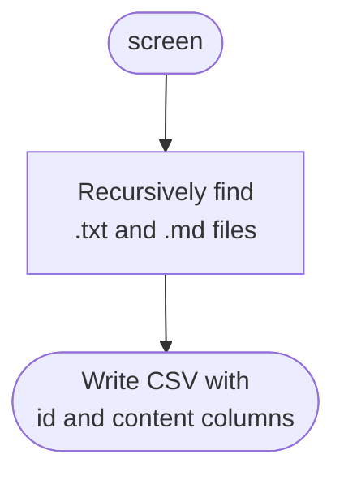
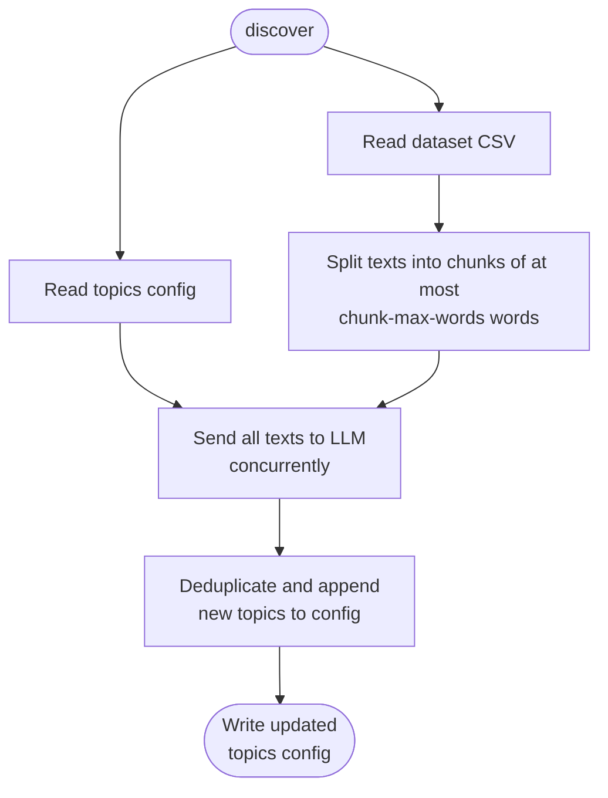
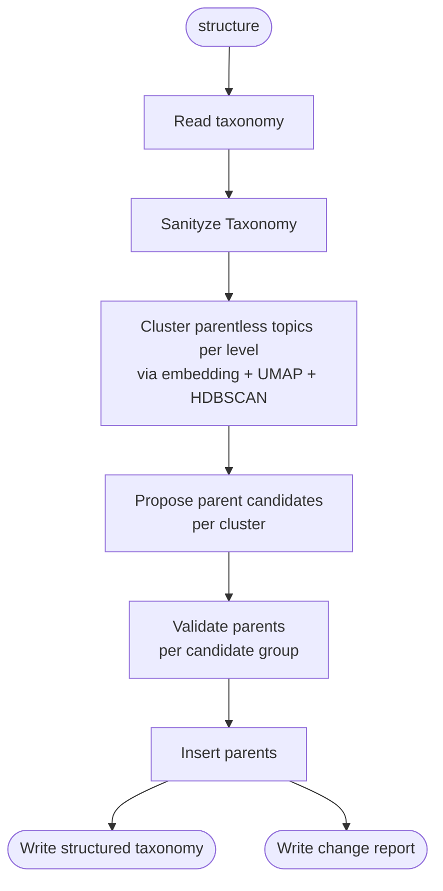
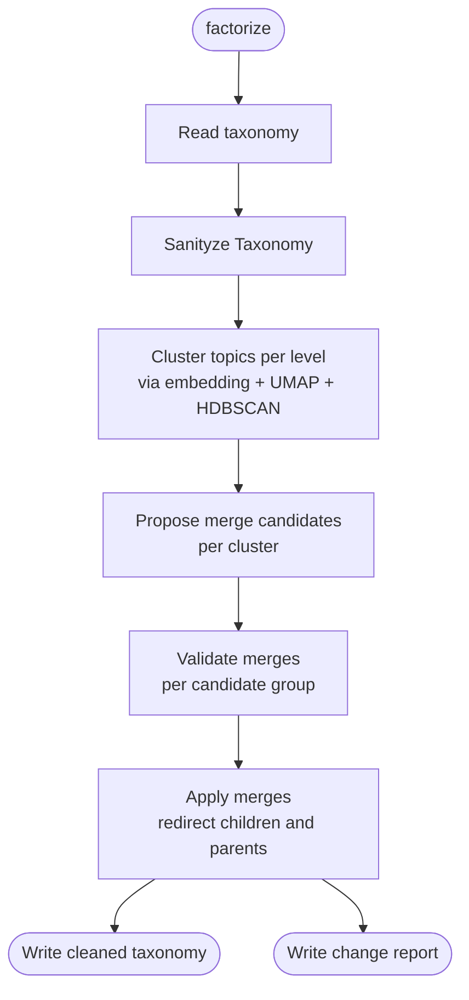
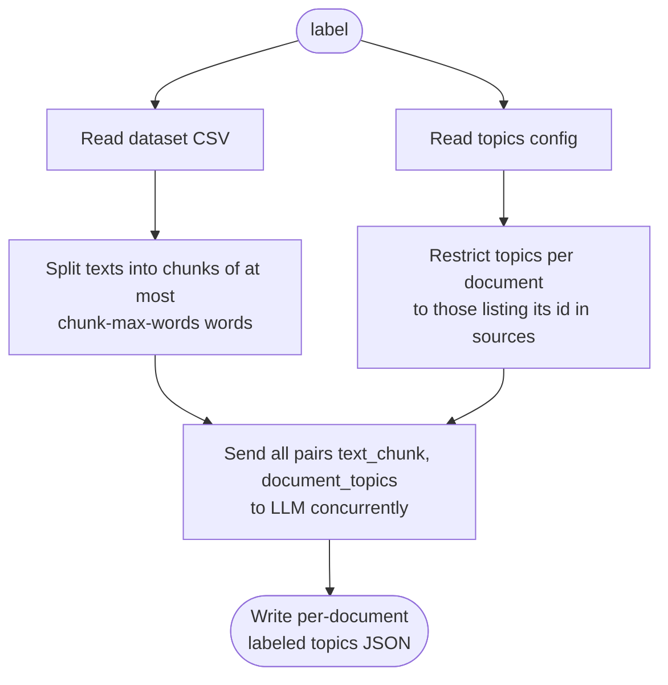

# Topic-builder

CLI tool for topic modeling backed by a language model.

**Requirements**: This project requires [uv](https://github.com/astral-sh/uv) 0.11+. If you wish to launch a local LLM server you will need [docker](https://www.docker.com/).

## Table of contents

- [1. Setup](#1-setup)
  - [Local setup](#local-setup)
  - [LLM server setup](#llm-server-setup)
- [2. Usage](#2-usage)
  - [Screen a directory into a dataset](#-screen-a-directory-into-a-dataset)
  - [Discover new topics](#-discover-new-topics)
  - [Discover parent topics to form a hierarchy](#-discover-parent-topics-to-form-a-hierarchy)
  - [Factorize existing topics](#-factorize-existing-topics)
  - [Label text using topics](#️-label-text-using-topics)
  - [Display the knowledge graph](#️-display-the-knowledge-graph)
- [3. Contribute](#3-contribute)

## 1. Setup

### Local setup

Install the project and its dependencies in an isolated virtual environment

```shell
uv sync
```

### LLM server setup

This project necessitates a LLM server with an openai-compatible API.
If necessary, you can set up a local `vllm` server with Docker Compose, see [`conf/docker/README.md`](conf/docker/README.md).

[Back to top](#topic-builder)

## 2. Usage

<details>
<summary>In a hurry ?</summary></br>

To run a smoke test, run in a bash shell (linux) or in wsl (Windows)

```shell
docker compose -f conf/docker/docker-compose.qwen3-4b-instruct-fp8.yml up
```

Then run in a bash shell

```shell
data/sample/recipe.sh
```

On ce done, stop the LLM server (`ctrl + C`) and shut down the container

```shell
docker compose -f conf/docker/docker-compose.qwen3-4b-instruct-fp8.yml down
```

---

</details>
</br>

In all commands requiring a LLM server, set the flag `--llm-config-path` pointing to the appropriate LLM client config, eg if `<my-server>.yaml` is running then use `--llm-config-path conf/clients/<my-server>.yaml`.

### 📂 Screen a directory into a dataset

Recursively collect all `.txt` and `.md` files under a directory and write them to a CSV dataset with `id` (file path) and `content` (file text) columns. This CSV is the input format expected by te tasks `discover` and `label`.

<details>
<summary>Flow</summary>



</details>
</br>

**Command:**

```shell
uv run topicbuilder screen [OPTIONS]
```

| Option | Description |
| --- | --- |
| `--input-dir PATH` | Directory to scan recursively for `.txt` and `.md` files |
| `--output-path PATH` | Path where the output CSV will be written |

**Example:**

```shell
uv run topicbuilder screen \
  --input-dir data/sample/raw \
  --output-path data/sample/dataset.csv
```

**Output — dataset CSV** (`--output-path`):

```csv
id,content
docs/intro.md,"This document covers..."
docs/sub/guide.txt,"Step-by-step instructions..."
```

[Back to top](#topic-builder)

### 🔍 Discover new topics

Identify new topics across a dataset CSV, and append them to an existing topics config if passed. The prompt describing the task is located at `conf/prompts/discover_topics.md` and is formated to generate outputs through function calling.

Notes:

- All documents are processed concurrently.
- Each topic records the id of the text it was discovered in, under `sources`.
- The topics config is appended to each LLM call, which can quickly consume the full window context if the config is large.

<details>
<summary>Flow</summary>



</details>
</br>

**Command:**

```shell
uv run topicbuilder discover-topics [OPTIONS]
```

| Option | Description |
| --- | --- |
| `--dataset-path PATH` | Path to a CSV file with `id` and `content` columns |
| `--taxonomy-path PATH` | *(optional)* Path to the existing taxonomy JSON. If omitted, starts from an empty taxonomy |
| `--llm-config-path PATH` | Path to the LLM client config YAML |
| `--output-path PATH` | Path where the updated taxonomy JSON will be written |
| `--prompt-path PATH` | *(optional)* Path to the system prompt file *(default: `conf/prompts/discover_topics.md`)* |
| `--chunk-max-words INT` | *(optional)* Max words per text chunk *(default: 500)* |

**Example:**

```shell
uv run topicbuilder discover-topics \
  --dataset-path data/sample/dataset.csv \
  --llm-config-path conf/clients/vllm-qwen3-4b-it-fp8.yaml \
  --output-path data/sample/analysis/taxonomy.json \
  --chunk-max-words 500
```

**Output — taxonomy JSON** (`--output-path`):

```json
{
  "topics": [
    {
      "id": "a1b2c3d4-e5f6-7890-abcd-ef1234567890",
      "name": "Short topic label",
      "description": "Concise, text-agnostic definition of the concept.",
      "sources": ["docs/intro.md"],
      "parent": null,
      "level": 0,
      "validated": false
    }
  ]
}
```

[Back to top](#topic-builder)

### 🌳 Discover parent topics to form a hierarchy

Group parentless topics under new parent meta-topics. The prompts describing the task are located at `conf/prompts/discover_parents`: one for generating cadidates of grouped topics, and another to clean each candidate group by creating a parent topic for the group. Prompts are formated to generate outputs through function calling.

The structuring pipeline runs per level. Within each level, parentless topics are grouped and processed in two LLM steps per group:

1. **Topic pre-clustering** — topic names are embedded, reduced with UMAP, and grouped with HDBSCAN into semantically coherent clusters (config at `--clustering-config-path`); ungrouped topics become singleton clusters.
2. **Candidate generation** — given a cluster of topic names only, the model proposes parent names with candidate children.
3. **Parent validation** — given the full name and description of each candidate group, the model confirms the parent name, writes a description, and selects the final subset of children.

New parent topics are created at `level = children_level + 1`.

Notes:

- Topics with different levels cannot be parented together, only topics belonging to the same level can.
- Topics with `"validated": true` are protected — they cannot be re-parented.

<details>
<summary>Flow</summary>



</details>
</br>

**Command:**

```shell
uv run topicbuilder discover-parents [OPTIONS]
```

| Option | Description |
| --- | --- |
| `--taxonomy-path PATH` | Path to the taxonomy JSON to structure |
| `--llm-config-path PATH` | Path to the LLM client config YAML |
| `--output-path PATH` | Path where the structured taxonomy JSON will be written |
| `--report-path PATH` | Path where the change report JSON will be written |
| `--prompts-dir PATH` | *(optional)* Directory containing the structure prompt files *(default: `conf/prompts/discover_parents`)* |
| `--clustering-config-path PATH` | *(optional)* Path to the clustering config YAML controlling the semantic pre-clustering step *(default: `conf/clustering/default.yaml`)* |

**Example:**

```shell
uv run topicbuilder discover-parents \
  --taxonomy-path data/sample/analysis/taxonomy_factorized.json \
  --llm-config-path conf/clients/vllm-qwen3-4b-it-fp8.yaml \
  --output-path data/sample/analysis/taxonomy_structured.json \
  --report-path data/sample/analysis/report_structuration.json
```

**Output — structured taxonomy JSON** (`--output-path`):

```json
{
  "topics": [
    {
      "id": "a1b2c3d4-e5f6-7890-abcd-ef1234567890",
      "name": "Child topic",
      "description": "Leaf concept definition.",
      "sources": ["docs/intro.md"],
      "parent": "b2c3d4e5-f6a7-8901-bcde-f12345678901",
      "level": 0,
      "validated": false
    },
    {
      "id": "b2c3d4e5-f6a7-8901-bcde-f12345678901",
      "name": "Parent meta-topic name",
      "description": "Broader concept grouping related children.",
      "sources": [],
      "parent": null,
      "level": 1,
      "validated": false
    }
  ]
}
```

[Back to top](#topic-builder)

### 🪛 Factorize existing topics

Merge near-duplicate topics of identical level into an existing target topic of the same level, when this latter is a good representative of a group of topics. The prompts describing the task are located at `conf/prompts/factorize`: one for generating cadidates of grouped topics, and another to clean each candidate group and selecting the target topic that will replace the others. Prompts are formated to generate outputs through function calling.

The merge pipeline consists in 3 steps:

1. **Topic pre-clustering** — topic names are embedded, reduced with UMAP, and grouped with HDBSCAN into semantically coherent clusters (config at `--clustering-config-path`); ungrouped topics become singleton clusters.
2. **Candidate generation** — given a cluster and its list of topic names, the model proposes sub-groups of potentially duplicate names.
3. **Merge validation** — given the full name and description of each candidate group, the model decides the actual merge operations.

Notes:

- Topics with different levels cannot be merged together, only topics belonging to the same level can.
- Topics with `"validated": true` cannot be merged and won't disappear.
- When topics are merged into a target topic, its children and parent are redirected to the surviving target, and the `sources` of every merged topic are unioned into it.

<details>
<summary>Flow</summary>



</details>
</br>

**Command:**

```shell
uv run topicbuilder factorize [OPTIONS]
```

| Option | Description |
| --- | --- |
| `--taxonomy-path PATH` | Path to the taxonomy JSON to clean |
| `--llm-config-path PATH` | Path to the LLM client config YAML |
| `--output-path PATH` | Path where the cleaned taxonomy JSON will be written |
| `--report-path PATH` | Path where the change report JSON will be written |
| `--prompts-dir PATH` | *(optional)* Directory containing the factorize prompt files *(default: `conf/prompts/factorize`)* |
| `--clustering-config-path PATH` | *(optional)* Path to the clustering config YAML controlling the semantic pre-clustering step *(default: `conf/clustering/default.yaml`)* |

**Example:**

```shell
uv run topicbuilder factorize \
  --taxonomy-path data/sample/analysis/taxonomy.json \
  --llm-config-path conf/clients/vllm-qwen3-4b-it-fp8.yaml \
  --output-path data/sample/analysis/taxonomy_factorized.json \
  --report-path data/sample/analysis/report_factorization.json
```

**Output — cleaned taxonomy JSON** (`--output-path`): same format as discover output.

[Back to top](#topic-builder)

### 🏷️ Label text using topics

Label each document in a dataset CSV using a topics config. The prompt describing the task is located at `conf/prompts/label.md` and is formated to generate outputs through function calling.

All documents are processed concurrently and results are keyed by document id. Texts are chunked by word count; each document is only offered the topics that record its id under `sources`.

Notes:

- A document that is not recorded as the source of any topic gets an empty label list, and no LLM call is made for it.
- Only leaf topics are used for labelling.

<details>
<summary>Flow</summary>



</details>
</br>

**Command:**

```shell
uv run topicbuilder label [OPTIONS]
```

| Option | Description |
| --- | --- |
| `--dataset-path PATH` | Path to a CSV file with `id` and `content` columns |
| `--taxonomy-path PATH` | Path to the taxonomy JSON |
| `--llm-config-path PATH` | Path to the LLM client config YAML |
| `--output-path PATH` | Path where the labeled topics JSON will be written |
| `--prompt-path PATH` | *(optional)* Path to the system prompt file *(default: `conf/prompts/label.md`)* |
| `--chunk-max-words INT` | *(optional)* Max words per text chunk *(default: 500)* |

**Example:**

```shell
uv run topicbuilder label \
  --dataset-path data/sample/dataset.csv \
  --taxonomy-path data/sample/analysis/taxonomy_structured.json \
  --llm-config-path conf/clients/vllm-qwen3-4b-it-fp8.yaml \
  --output-path data/sample/analysis/instances.json \
  --chunk-max-words 500
```

**Output — labeled topics JSON** (`--output-path`):

```json
{
  "documents": [
    {
      "id": "docs/intro.md",
      "labels": [
        {
          "name": "Short topic label",
          "rationale": "1–3 sentence justification of why this topic is present in the text.",
          "extract": "Verbatim excerpt from the input text that best illustrates the topic."
        }
      ]
    }
  ]
}
```

[Back to top](#topic-builder)

### 🖥️ Display the knowledge graph

Launch an interactive browser-based viewer for a taxonomy JSON. The graph renders topics as nodes and parent–child relationships as directed edges.

**Command:**

```shell
uv run topicbuilder display [OPTIONS]
```

| Option | Description |
| --- | --- |
| `--taxonomy-path PATH` | Path to the taxonomy JSON file to visualise *(required)* |
| `--labels-path PATH` | *(optional)* Path to a labeled-dataset JSON to show per-topic rationale and extracts in the detail panel |
| `--port INTEGER` | Port to listen on *(default: 8050)* |
| `--debug` | Run the Dash server in debug mode |

**Example:**

```shell
uv run topicbuilder display \
  --taxonomy-path data/sample/analysis/taxonomy_structured.json \
  --labels-path data/sample/analysis/instances.json \
  --port 8080
```

Then open `http://localhost:8080` in your browser.

[Back to top](#topic-builder)

## 3. Contribute

- Create a feature branch
- Install the project `uv sync` and pre-commits `pre-commit install`
- Create your changes by following the development rules at `.claude/rules/develop.md`
- Test your changes by following the testing rules at `.claude/rules/test.md`
- Open a MR and tag at least the owner of this repository.

[Back to top](#topic-builder)
